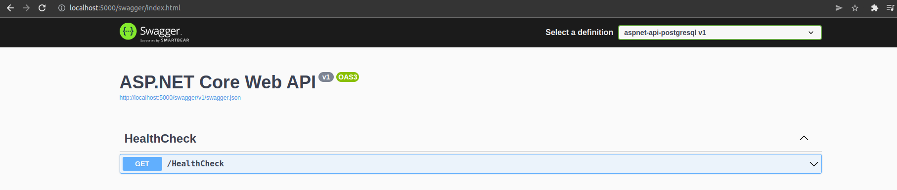

## Compose sample application: ASP.Net API with Postgresql database

Project Structure
```
.
├── api
│   ├── appsettings.json
│   ├── ...
└── docker-compose.yaml
```
[_docker-compose.yaml](docker-compose.yml)

```
services:
  api:
    image: mcr.microsoft.com/dotnet/sdk
    container_name: "api"
    ports:
      - 5000:5000
    ...
  db:
      image: postgres:10.5
      restart: always
      ...
```

The compose file defines an application with two services `api` and `db`. The api service is configured without a Dockerfile and to run using your local volume in `watch` mode.

## Deploy with docker-compose

```
$ docker-compose up -d
Pulling db (postgres:10.5)...
10.5: Pulling from library/postgres
...
Status: Downloaded newer image for postgres:10.5
Pulling api (mcr.microsoft.com/dotnet/sdk:)...
latest: Pulling from dotnet/sdk
...
Status: Downloaded newer image for mcr.microsoft.com/dotnet/sdk:latest
Creating aspnet-api-postgresql_db_1 ... done
Creating api                        ... done
```

## Expected result

```
$ docker ps
CONTAINER ID   IMAGE                          COMMAND                  CREATED              STATUS              PORTS                                       NAMES
48c8a8911cfb   mcr.microsoft.com/dotnet/sdk   "dotnet watch run --…"   About a minute ago   Up About a minute   0.0.0.0:5000->5000/tcp, :::5000->5000/tcp   api
84082957734e   postgres:10.5                  "docker-entrypoint.s…"   About a minute ago   Up About a minute   0.0.0.0:5432->5432/tcp, :::5432->5432/tcp   aspnet-api-postgresql_db_1
```

After the application starts, navigate to http://localhost:5000/swagger/index.html in your web browser.



Stop and remove the containers

```
$ docker-compose down
```