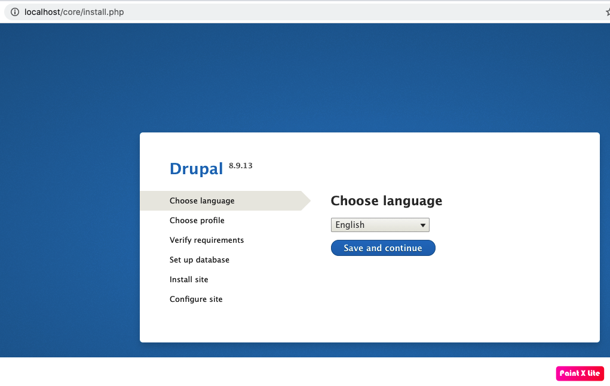

## Drupal 8 with MySQL
This example defines one of the basic setups for Drupal. More details on how this works can be found on the official [drupal image page](https://hub.docker.com/_/drupal).


Project structure:
```
.
├── docker-compose.yaml
└── README.md
```

[_docker-compose.yaml_](docker-compose.yaml)
```
services:
  db:
    image: mysql:8.0.19
    ...
  drupal8-cms:
    image: drupal:8-apache
    ports:
      - 80:80
    restart: always
    ...
```

When deploying this setup, docker-compose maps the Drupal container port 80 to
port 80 of the host as specified in the compose file.

## Deploy with docker-compose

```
$ docker-compose up -d
Creating network "drupal8-mysql_default" with the default driver
Pulling db (mysql:8.0.19)...
8.0.19: Pulling from library/mysql
...
...
Digest: sha256:9643e9fbd6330d10686f8922292dcb20995e7b792c17d4e94ddf95255f1d5449
Status: Downloaded newer image for mysql:8.0.19
Pulling drupal8-cms (drupal:8-apache)...
8-apache: Pulling from library/drupal
...
...
Digest: sha256:ec9db81130f3e369ead51ed92537eedc7c6e86630cabd9f8ea297f7ddd6130f1
Status: Downloaded newer image for drupal:8-apache
Creating drupal8-mysql_drupal8-cms_1 ... done
Creating drupal8-mysql_db_1          ... done
```


## Expected result

Check containers are running and the port mapping:
```
$ docker ps
CONTAINER ID   IMAGE                    COMMAND                  CREATED         STATUS         PORTS                  NAMES
11e4e988298e   drupal:8-apache          "docker-php-entrypoi…"   6 minutes ago   Up 6 minutes   0.0.0.0:80->80/tcp     drupal8-mysql_drupal8-cms_1
cc73f16d1b6f   mysql:8.0.19             "docker-entrypoint.s…"   6 minutes ago   Up 6 minutes   3306/tcp, 33060/tcp    drupal8-mysql_db_1
```

Navigate to `http://localhost:80` in your web browser to access Drupal.



Stop and remove the containers

```
$ docker-compose down
```

To remove all Gitea data, delete the named volumes by passing the `-v` parameter:
```
$ docker-compose down -v
```