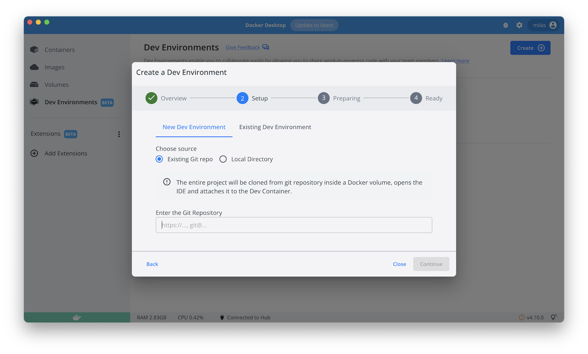

## Compose sample application
### Python/Flask application

Project structure:
```
.
├── compose.yaml
├── app
    ├── Dockerfile
    ├── requirements.txt
    └── app.py

```

[_compose.yaml_](compose.yaml)
```
services: 
  web: 
    build:
     context: app
     target: builder
    ports: 
      - '8000:8000'
```

## Deploy with docker compose

```
$ docker compose up -d
[+] Building 1.1s (16/16) FINISHED
 => [internal] load build definition from Dockerfile                                                                                                                                                                                       0.0s
    ...                                                                                                                                         0.0s
 => => naming to docker.io/library/flask_web                                                                                                                                                                                               0.0s
[+] Running 2/2
 ⠿ Network flask_default  Created                                                                                                                                                                                                          0.0s
 ⠿ Container flask-web-1  Started
```

## Expected result

Listing containers must show one container running and the port mapping as below:
```
$ docker compose ps
NAME                COMMAND             SERVICE             STATUS              PORTS
flask-web-1         "python3 app.py"    web                 running             0.0.0.0:8000->8000/tcp
```

After the application starts, navigate to `http://localhost:8000` in your web browser or run:
```
$ curl localhost:8000
Hello World!
```

Stop and remove the containers
```
$ docker compose down
```

## Use with Docker Development Environments

You can use this sample with the Dev Environments feature of Docker Desktop.



To develop directly on the services inside containers, use the HTTPS Git url of the sample:
```
https://github.com/docker/awesome-compose/tree/master/flask
```
