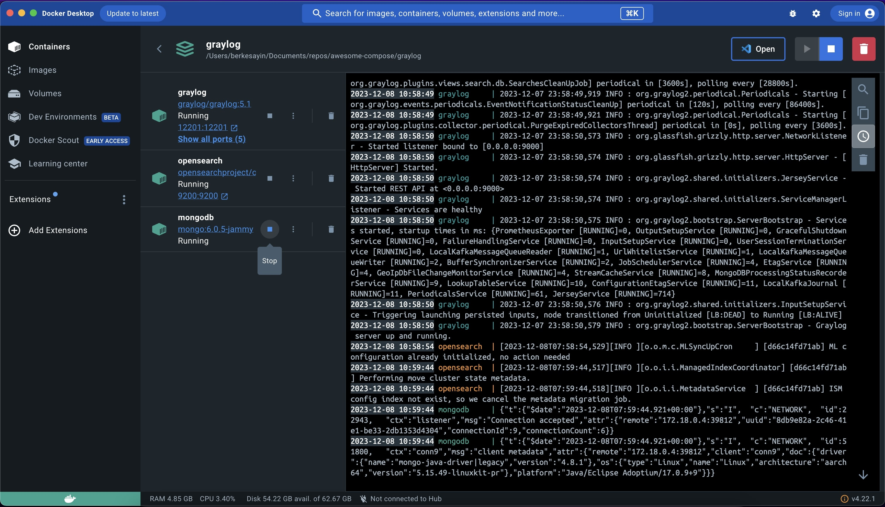
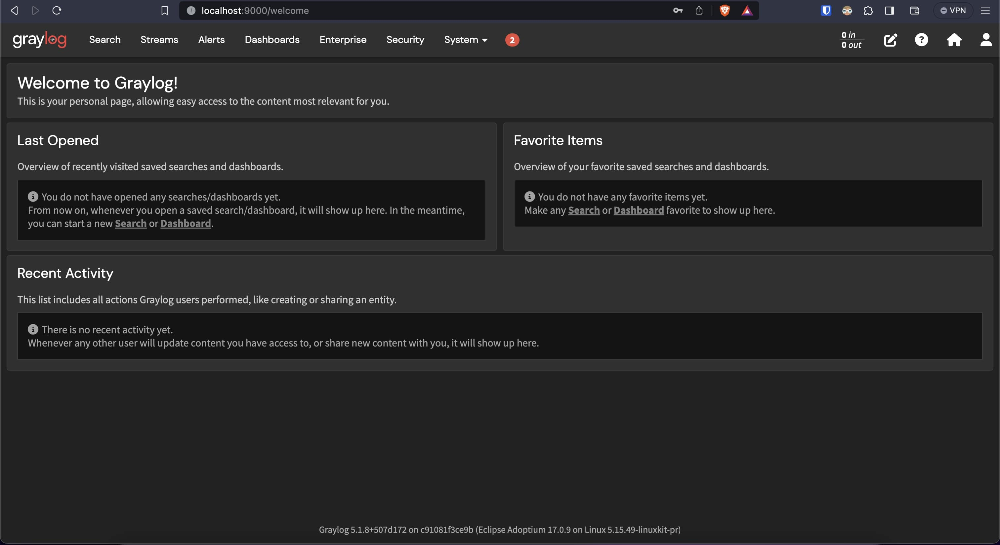

## Compose sample application

### Use with Docker Development Environments

You will need a recent version of Docker, at least v20.10.10. In addition, use the following Docker images to run Graylog Server.

- Graylog: [graylog/graylog](https://hub.docker.com/u/graylog)
- MongoDB: [mongo](https://hub.docker.com/_/mongo)
- OpenSearch: [opensearchproject/opensearch](https://hub.docker.com/r/opensearchproject/opensearch/tags?page=1&ordering=last_updated&name=2.7.0)

This Docker Compose configuration uses three services which are MongoDB, Opensearch, and Graylog to create a comprehensive log management system.

MongoDB stores Graylog's configuration, Opensearch stores the log data, and Graylog provides the user interface and processing logic to manage and analyze logs efficiently.

### Run Graylog Server Using Docker Compose

Project structure:

```
.
├── outputs
│   └── output1.jpg
│   └── output2.jpg
│   └── output3.jpg
│
└── .env.example
└── compose.yaml
└── README.md
```

### Generate SHA-256 Hash For Password

    echo -n YourPassword | shasum -a 256

This will give the SHA-256 hash of the string "YourPassword". The output will be a 64-character hexadecimal string representing the SHA-256 hash of the specified password.

After you've configured `GRAYLOG_PASSWORD_SECRET` and `GRAYLOG_ROOT_PASSWORD_SHA2` at. `.env` and `compose.yaml` file, navigate to the directory and run these commands to start the instance:

    docker-compose up

To start it daemonized, run:

    docker-compose up -d

Default client port is `9000`. So now you can navigate to `http://localhost:9000`.

### Expected Result

Containers started after running `docker-compose up` command. You can also check at terminal with `docker ps`.



Navigate to `http://localhost:9000`.


Login the Graylog Server


