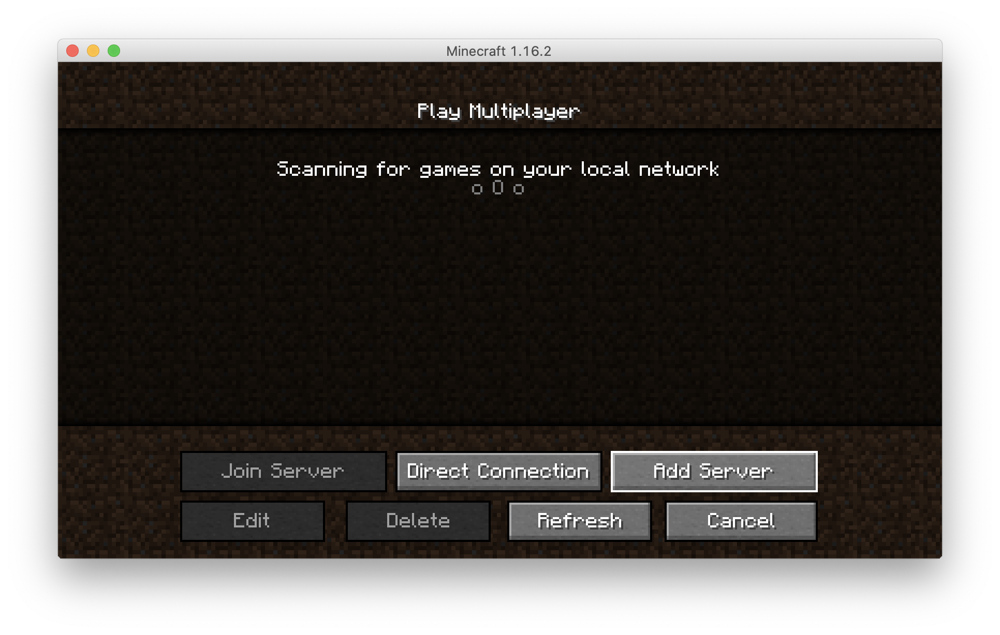
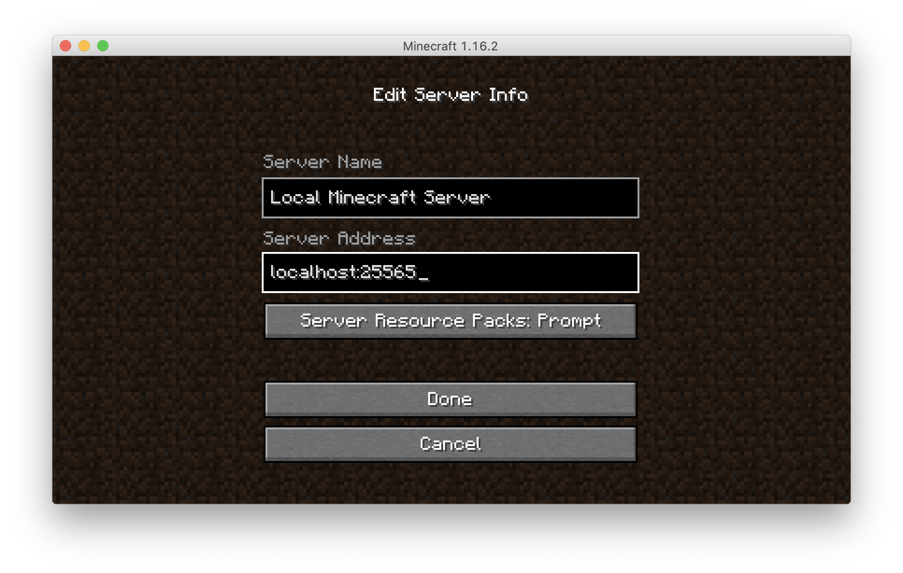
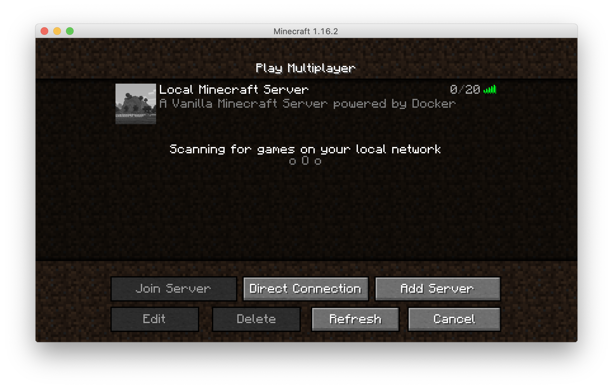

## Minecraft server
This example defines a basic setup for a Minecraft server. More details on the Minecraft server docker image can be found [here](https://github.com/itzg/docker-minecraft-server/blob/master/README.md).

Project structure:
```
.
├── docker-compose.yaml
└── README.md
```

[_docker-compose.yaml_](docker-compose.yaml)
```
services:
 minecraft:
   image: itzg/minecraft-server
   ports:
     - "25565:25565"
    ...
  volumes:
     - "~/minecraft_data:/data"
```

When deploying this setup, docker-compose maps the Minecraft server port 25565 to
the same port of the host as specified in the compose file. The Minecraft client application can connect to this port directly.
This example maps the Minecraft data folder holding all game storage to ~/minecraft_data on the host.

## Deploy with docker-compose

```
$ mkdir -p ~/minecraft_data
$ docker-compose up -d
WARNING: Some services (minecraft) use the 'deploy' key, which will be ignored. Compose does not support 'deploy' configuration - use `docker stack deploy` to deploy to a swarm.
Creating network "minecraft_default" with the default driver
Creating minecraft_minecraft_1 ... done
```

Note: this is using a volume in order to store Minecraft server data, that can be recovered if you remove the container and restart it. 

## Expected result

Check containers are running and the port mapping:

```
$ docker ps
CONTAINER ID        IMAGE                   COMMAND             CREATED             STATUS                   PORTS                                 NAMES
7f696c2fb101        itzg/minecraft-server   "/start"            5 minutes ago       Up 5 minutes (healthy)
```

After running `docker-compose up`, the minecraft server takes a bit of time to initialize Minecraft world. You can follow the progress:

```
$ docker-compose logs
...
minecraft_1  | [15:06:39] [Worker-Main-6/INFO]: Preparing spawn area: 94%
minecraft_1  | [15:06:39] [Worker-Main-7/INFO]: Preparing spawn area: 94%
minecraft_1  | [15:06:39] [Server thread/INFO]: Time elapsed: 25620 ms
minecraft_1  | [15:06:39] [Server thread/INFO]: Done (35.526s)! For help, type "help"
minecraft_1  | [15:06:39] [Server thread/INFO]: Starting remote control listener
minecraft_1  | [15:06:39] [Server thread/INFO]: Thread RCON Listener started
minecraft_1  | [15:06:39] [RCON Listener #1/INFO]: RCON running on 0.0.0.0:25575
```

Once it is initialized, run your Minecraft application, hit "Play", then "Multiplayer" and "Add server"


 Specify your new server IP : localhost:25565
 

 You can then start playing
 

Stop and remove the containers

```
$ docker-compose down
```

To delete all data, remove all named volumes by passing the -v arguments:

```
$ docker-compose down -v
```