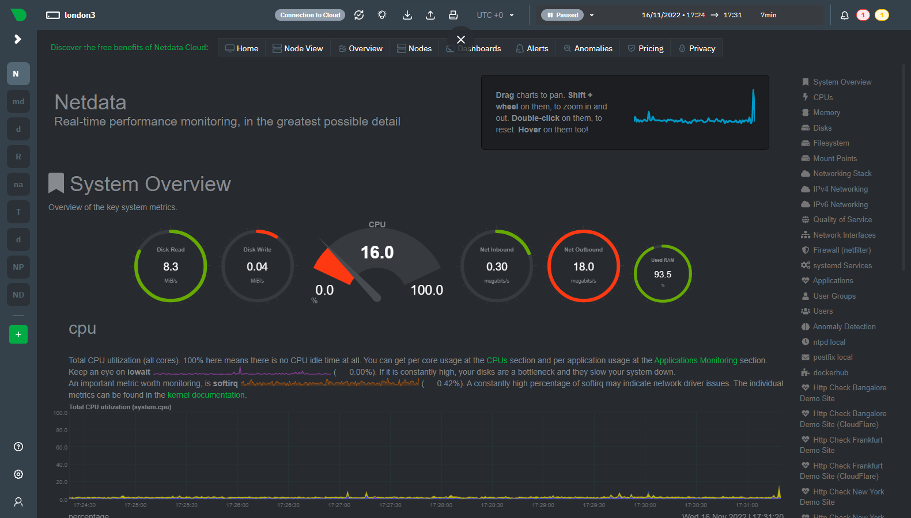

## Compose sample
### [Netdata](https://github.com/netdata/netdata)

Project structure:
```
.
├── compose.yaml
└── README.md
```

[_compose.yaml_](compose.yaml)
```yaml
version: '3'
services:
  netdata:
    image: netdata/netdata
    container_name: netdata
    hostname: example.com # set to fqdn of host
    ports:
      - 19999:19999
    restart: unless-stopped
    cap_add:
      - SYS_PTRACE
    security_opt:
      - apparmor:unconfined
    volumes:
      - netdataconfig:/etc/netdata
      - netdatalib:/var/lib/netdata
      - netdatacache:/var/cache/netdata
      - /etc/passwd:/host/etc/passwd:ro
      - /etc/group:/host/etc/group:ro
      - /proc:/host/proc:ro
      - /sys:/host/sys:ro
      - /etc/os-release:/host/etc/os-release:ro

volumes:
  netdataconfig:
  netdatalib:
  netdatacache:
```
The compose file defines a stack with the service `netdata` and available at port `19999` by default. More information around installation options and configuration via Docker can be found in the Netdata docs [here](https://learn.netdata.cloud/docs/agent/packaging/docker).
Make sure the port 19999 on the host is not already in use.

## Deploy with docker compose

```
$ docker compose up -d
[+] Running 8/8
 ⠿ netdata Pulled
[+] Running 5/5
 ⠿ Network tmp_default         Created
 ⠿ Volume "tmp_netdatalib"     Created
 ⠿ Volume "tmp_netdatacache"   Created
 ⠿ Volume "tmp_netdataconfig"  Created
 ⠿ Container netdata           Started
```

## Expected result

Listing containers must show two containers running and the port mapping as below:
```
$ docker ps
NAME                COMMAND              SERVICE             STATUS              PORTS
netdata             "/usr/sbin/run.sh"   netdata             running (healthy)   0.0.0.0:19999->19999/tcp
```

Navigate to `http://localhost:19999` in your web browser to access the local Netdata dashboard or run:

```
$ curl localhost:19999/api/v1/allmetrics
# chart: system.idlejitter (name: system.idlejitter)
NETDATA_SYSTEM_IDLEJITTER_MIN="73"      # microseconds lost/s
NETDATA_SYSTEM_IDLEJITTER_MAX="231"      # microseconds lost/s
NETDATA_SYSTEM_IDLEJITTER_AVERAGE="109"      # microseconds lost/s
NETDATA_SYSTEM_IDLEJITTER_VISIBLETOTAL="413"      # microseconds lost/s
...
```



Stop and remove the containers. Use `-v` to remove the volumes if looking to erase all data.
```
$ docker compose down -v
```
