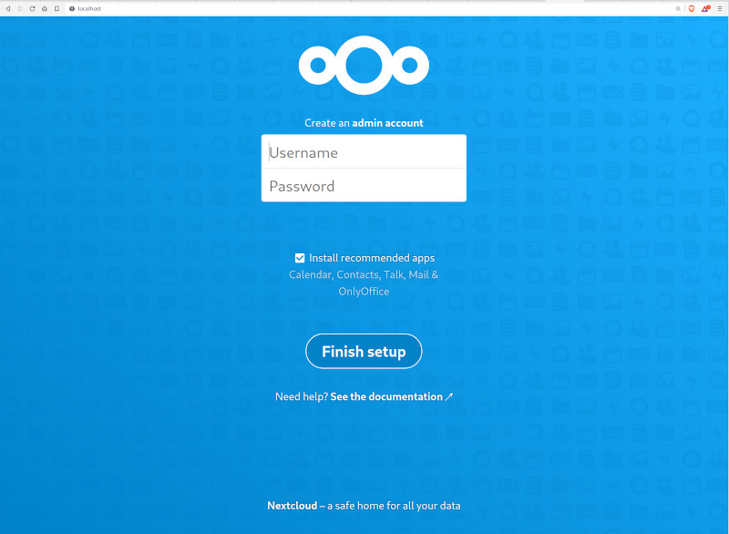

## Nextcloud with Postgres database
This example defines one of the base setups for Nextcloud. More details on how to
further customize the installation and the compose file can be found on the
[official image page](https://hub.docker.com/_/nextcloud).


Project structure:
```
.
├── docker-compose.yaml
└── README.md
```

[_docker-compose.yaml_](docker-compose.yaml)
```
services:
  nc:
    image: nextcloud:apache
    ports:
      - 80:80
    ...
  db:
    image: postgres:alpine
    ...
```

When deploying this setup, docker-compose maps the nextcloud container port 80 to
port 80 of the host as specified in the compose file.

## Deploy with docker-compose

```
$ docker$ compose up -d
Creating network "nextcloud-postgres_default" with the default driver
Creating volume "nextcloud-postgres_nc_data" with default driver
Pulling nc (nextcloud:apache)...
....
....
Status: Downloaded newer image for postgres:alpine
Creating nextcloud-postgres_nc_1 ... done
Creating nextcloud-postgres_db_1 ... done
```


## Expected result

Check containers are running and the port mapping:
```
$ docker ps
CONTAINER ID        IMAGE               COMMAND                  CREATED             STATUS              PORTS                NAMES
9884a9cc0144        postgres:alpine     "docker-entrypoint.s…"   12 minutes ago      Up 12 minutes       5432/tcp             nextcloud-postgres_db_1
bae385bee48b        nextcloud:apache    "/entrypoint.sh apac…"   12 minutes ago      Up 12 minutes       0.0.0.0:80->80/tcp   nextcloud-postgres_nc_1
```

Navigate to `http://localhost:80` in your web browser to access the installed
Nextcloud service.



Stop and remove the containers

```
$ docker-compose down
```
