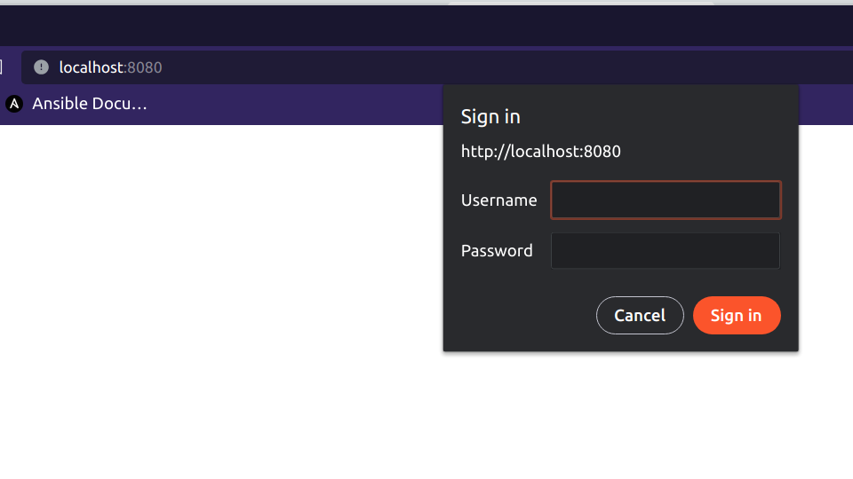
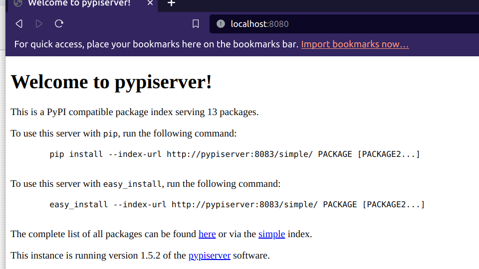
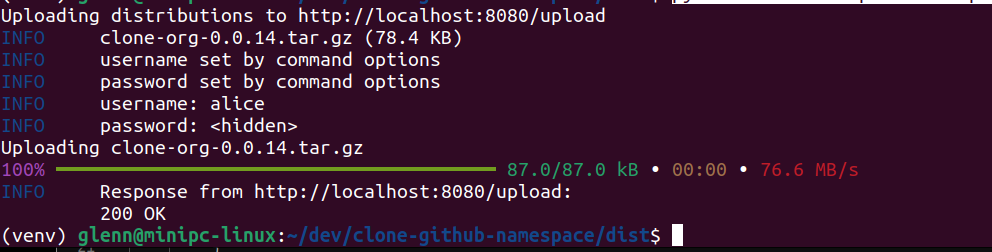

# Nginx providing a reverse proxy for pypiserver with basic authentication on a per route basis


## Purpose
Nginx is capable of providing a reverse proxy with basic authentication for a service. This is a simple example of how 
to do that. The upload route is protected with a different password to the base route. The intent of this is to 
allow the upload route to be protected with a more restricted set of users than the base route. The nginx configuration
is set to delay the response to a failed authentication for 5 seconds. This is to slow down brute force attacks. The upload
route is redirected internally to the pypiserver service and is only for POST methods. In this way we have added the 
admin password to a route that is for uploads based on the POST verb.

In this example two users are used, bob and alice. The password for both is **password**. You would not hardcode the passwords.
This is for demonstration purposes only. In addition only the nginx port would be exposed to the internet. 


## Project structure:
```
.
├── docker-compose.yaml
└── README.md
```
[_compose.yaml_](compose.yaml)
```yaml
services:
  pypiserver:
    image: pypiserver/pypiserver:latest
    command: 'run -p 8083 -a . -P .'
    ports:
      - "8083:8083"
    volumes:
      - type: bind
        source: ./packages
        target: /data/packages
  proxy:
    depends_on:
      - pypiserver
    image: nginx:1.19
    ports:
      - "8080:8080"
    volumes:
      - ./nginx-basic-auth.conf:/etc/nginx/conf.d/nginx-basic-auth.conf
    command: >
      /bin/sh -c " echo 'password' >> /etc/nginx/my_test_passwords.txt
      && echo -n 'bob:' >> /etc/nginx/.htpasswd
      && openssl passwd -apr1 -in /etc/nginx/my_test_passwords.txt >> /etc/nginx/.htpasswd
      && echo -n 'alice:' >> /etc/nginx/.adminpasswd
      && openssl passwd -apr1 -in /etc/nginx/my_test_passwords.txt >> /etc/nginx/.adminpasswd
      && nginx -g 'daemon off;'"

```
## Deploy with docker compose

```
docker compose up 
...
Creating network "nginx-proxy-auth-work_default" with the default driver
Creating nginx-proxy-auth-work_pypiserver_1 ... done
Creating nginx-proxy-auth-work_proxy_1      ... done
Attaching to nginx-proxy-auth-work_pypiserver_1, nginx-proxy-auth-work_proxy_1

```
## Expected result

```shell
CONTAINER ID   IMAGE                          COMMAND                  CREATED             STATUS             PORTS                                                 NAMES
48b2d67d903a   nginx:1.19                     "/docker-entrypoint.…"   About an hour ago   Up About an hour   80/tcp, 0.0.0.0:8080->8080/tcp, :::8080->8080/tcp     nginx-proxy-auth-work_proxy_1
666d314425ae   pypiserver/pypiserver:latest   "/entrypoint.sh run …"   About an hour ago   Up About an hour   8080/tcp, 0.0.0.0:8083->8083/tcp, :::8083->8083/tcp   nginx-proxy-auth-work_pypiserver_1
G
```
## Testing
In a browser go to the following link

[http://localhost:8080](http://localhost:8080)

This is what you should see



Following regular login you should see the following



The base route is protected with basic auth using the .htpassword file.

The pypiserver upload route is protected with basic auth using the .adminpasswd file. The following gives an example of
how to upload a package to the pypiserver service using [twine](https://twine.readthedocs.io/en/latest/).

```shell
python -m twine upload --repository-url http://localhost:8080/upload clone-org-0.0.14.tar.gz -u alice -p password --verbose
```




Stop and remove the containers

```
$ docker compose down
```

