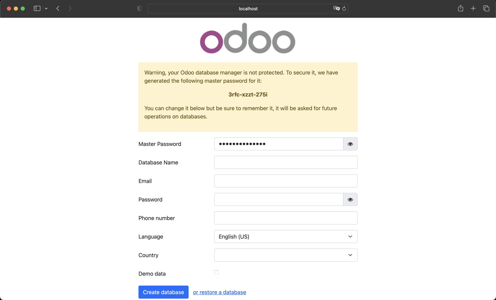
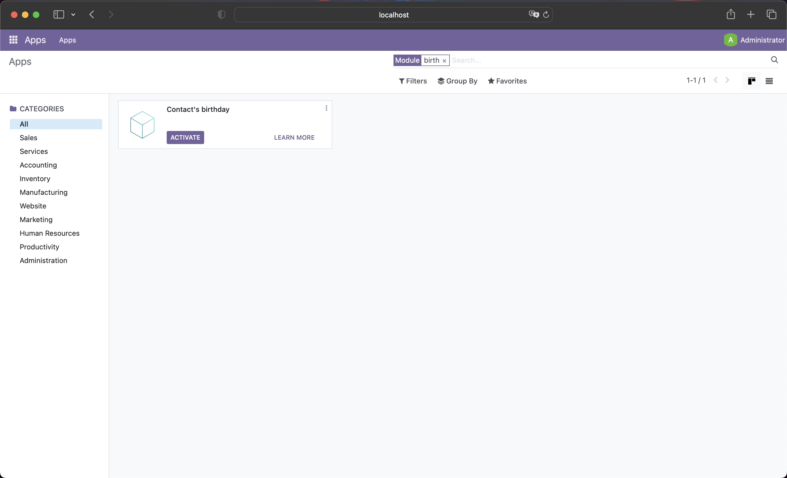

## Compose sample

Odoo is a suite of open source business apps including, for example, CRM,
eCommerce, accounting, etc. This example provides a basic setup to start
developing applications.

For more information about how to use Odoo with Docker or how to deploy Odoo
for production environment check the official Odoo [docker image](https://hub.docker.com/_/odoo/) page
or the official Odoo [documentation](https://www.odoo.com/documentation/16.0/administration/install/deploy.html)
page respectively.

Project structure:
```shell
odoo
├── compose.yaml
├── conf
│   └── odoo.conf
├── extra-addons
│   └── contact_birthdate
│       ├── __init__.py
│       ├── __manifest__.py
│       ├── models
│       │   ├── __init__.py
│       │   └── res_partner.py
│       ├── README.md
│       ├── static
│       │   └── description
│       │       └── icon.png
│       └── views
│           └── res_partner.xml
├── output.png
└── README.md
```

> The *contact_birthdate* folder is a simple demo module that enables the
> birthday date for individual type contacts.

[_compose.yaml_](compose.yaml)

```yml
services:
  odoo:
    image: odoo:16.0
    platform: linux/amd64
    container_name: odoo
    ...
```

The compose file defines two services called odoo and postgres. When
deploying, Docker Compose maps ports 8069 and 5432 of the odoo and
postgres service containers to host ports 8069 and 5432, so make sure
that both ports are not already being in use.

> The `tty: true` and `stdin_open: true` flags enable interactive mode,
> this is especially useful if you want to use a Python debugger such
> as `pdb`.

## Deploying with docker compose

```shell
$ docker compose up -d
[+] Running 5/5
 ⠿ Network odoo_default     Created
 ⠿ Volume "odoo_odoo-data"  Created
 ⠿ Volume "odoo_psql-data"  Created
 ⠿ Container postgres       Started
 ⠿ Container odoo           Started
```

## Expected result

Listing containers must show two containers running and the port mapping as below:
```shell
$ docker ps
CONTAINER ID   IMAGE           COMMAND                  CREATED         STATUS         PORTS                                   NAMES
374a18da3b63   odoo:16.0       "/entrypoint.sh odoo"    2 minutes ago   Up 2 minutes   0.0.0.0:8069->8069/tcp, 8071-8072/tcp   odoo
c3bbddf884d4   postgres:14.5   "docker-entrypoint.s…"   2 minutes ago   Up 2 minutes   0.0.0.0:5432->5432/tcp                  postgres
```

After the containers start, go to `http://localhost:8069` in your favorite web browser.



Once a new database is created, you will find the demo module along with all other
available applications in the Apps menu.



To stop and remove the containers execute:

```shell
$ docker compose down
```

To remove the volumes execute:

```shell
$ docker compose down -v
```

## Troubleshooting

If you are running docker on a Mac with an Apple chip you may get the
following error message when trying to pull the odoo image:

```shell
Using default tag: latest
latest: Pulling from library/odoo
no matching manifest for linux/arm64/v8 in the manifest list entries
```

This is because there is no *linux/arm64* image available yet, so to avoid
this problem you must explicitly specify in the compose file the platform
to use as follow: `platform: linux/amd64`.

There is an open [issue](https://github.com/odoo/docker/issues/349) related
to this subject on GitHub.
