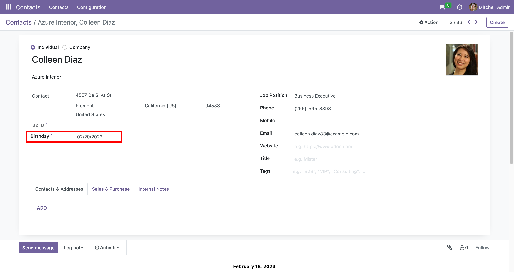

===================
Contact's birthday
===================

This module enables the birthday date for individual type contacts.

**Table of contents**

.. contents::
   :local:

Configuration
=============

There is no need for any additional configuration to enable this feature.

Usage
=====

Go to Contacts, then select a contact and set the birthday date.

Credits
=======

Authors
~~~~~~~

* Alexander Olivares <alexanderolivares@gmail.com>
