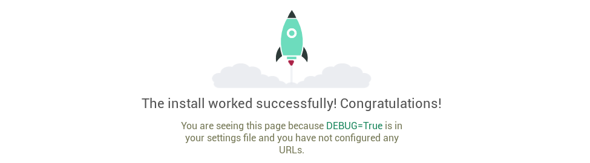

# Quickstart: Compose and Django

This quick-start guide demonstrates how to use Docker Compose to set up and run a simple Django/PostgreSQL app. Before starting,
[install Compose](https://docs.docker.com/compose/install/).

## Define the project components

For this project, you need to create a Dockerfile, a Python dependencies file,
and a `docker-compose.yml` file. (You can use either a `.yml` or `.yaml` extension for this file.)

1. Create an empty project directory.

    You can name the directory something easy for you to remember. This directory is the context for your application image. The directory should only contain resources to build that image.

2. Create a new file called `Dockerfile` in your project directory.

    The Dockerfile defines an application's image content via one or more build
    commands that configure that image. Once built, you can run the image in a
    container.  For more information on `Dockerfile`, see the [Docker user guide](https://docs.docker.com/get-started/)
    and the [Dockerfile reference](https://docs.docker.com/engine/reference/builder/).

3. Add the following content to the `Dockerfile`.

   ```dockerfile
   # syntax=docker/dockerfile:1
   FROM python:3
   ENV PYTHONDONTWRITEBYTECODE=1
   ENV PYTHONUNBUFFERED=1
   WORKDIR /code
   COPY requirements.txt /code/
   RUN pip install -r requirements.txt
   COPY . /code/
   ```

   This `Dockerfile` starts with a [Python 3 parent image](https://hub.docker.com/r/library/python/tags/3/).
   The parent image is modified by adding a new `code` directory. The parent image is further modified
   by installing the Python requirements defined in the `requirements.txt` file.

4. Save and close the `Dockerfile`.

5. Create a `requirements.txt` in your project directory.

    This file is used by the `RUN pip install -r requirements.txt` command in your `Dockerfile`.

6. Add the required software in the file.

    ```python
    Django>=3.0,<4.0
    psycopg2>=2.8
    ```

7. Save and close the `requirements.txt` file.

8. Create a file called `docker-compose.yml` in your project directory.

    The `docker-compose.yml` file describes the services that make your app. In
    this example those services are a web server and database.  The compose file
    also describes which Docker images these services use, how they link
    together, any volumes they might need to be mounted inside the containers.
    Finally, the `docker-compose.yml` file describes which ports these services
    expose. See the [`docker-compose.yml` reference](https://docs.docker.com/compose/compose-file/) for more
    information on how this file works.

9. Add the following configuration to the file.

   ```yaml
   services:
     db:
       image: postgres
       volumes:
         - ./data/db:/var/lib/postgresql/data
       environment:
         - POSTGRES_DB=postgres
         - POSTGRES_USER=postgres
         - POSTGRES_PASSWORD=postgres
     web:
       build: .
       command: python manage.py runserver 0.0.0.0:8000
       volumes:
         - .:/code
       ports:
         - "8000:8000"
       environment:
         - POSTGRES_NAME=postgres
         - POSTGRES_USER=postgres
         - POSTGRES_PASSWORD=postgres
       depends_on:
         - db
   ```

   This file defines two services: The `db` service and the `web` service.

   > Note:
   >
   > This uses the build in development server to run your application
   > on port 8000. Do not use this in a production environment. For more
   > information, see [Django documentation](https://docs.djangoproject.com/en/3.1/intro/tutorial01/#the-development-server){: target="_blank" rel="noopener" class="_”}.

10. Save and close the `docker-compose.yml` file.

## Create a Django project

In this step, you create a Django starter project by building the image from the build context defined in the previous procedure.

1. Change to the root of your project directory.

2. Create the Django project by running the [docker compose run](https://docs.docker.com/engine/reference/commandline/compose_run/)
   command as follows.

   ```console
   sudo docker compose run web django-admin startproject composeexample .
   ```

   This instructs Compose to run `django-admin startproject composeexample`
   in a container, using the `web` service's image and configuration. Because
   the `web` image doesn't exist yet, Compose builds it from the current
   directory, as specified by the `build: .` line in `docker-compose.yml`.

   Once the `web` service image is built, Compose runs it and executes the
   `django-admin startproject` command in the container. This command
   instructs Django to create a set of files and directories representing a
   Django project.

3. After the `docker compose` command completes, list the contents of your project.

   ```console
   $ ls -l

   drwxr-xr-x 2 root   root   composeexample
   drwxr-xr-x 3 root   root   data
   -rw-rw-r-- 1 user   user   docker-compose.yml
   -rw-rw-r-- 1 user   user   Dockerfile
   -rwxr-xr-x 1 root   root   manage.py
   -rw-rw-r-- 1 user   user   requirements.txt
   ```

   If you are running Docker on Linux, the files `django-admin` created are
   owned by root. This happens because the container runs as the root user.
   Change the ownership of the new files.

   Do not change the permission of the data folder where Postgres has its file, otherwise Postgres will not be able to start due to permission issues.

   ```console
   sudo chown -R $USER:$USER composeexample manage.py
   ```

   If you are running Docker on Mac or Windows, you should already
   have ownership of all files, including those generated by
   `django-admin`. List the files just to verify this.

   ```console
   $ ls -l

   total 32
   -rw-r--r--  1 user  staff  145 Feb 13 23:00 Dockerfile
   drwxr-xr-x  6 user  staff  204 Feb 13 23:07 composeexample
   -rw-r--r--  1 user  staff  159 Feb 13 23:02 docker-compose.yml
   -rwxr-xr-x  1 user  staff  257 Feb 13 23:07 manage.py
   -rw-r--r--  1 user  staff   16 Feb 13 23:01 requirements.txt
   ```

### Connect the database

In this section, you set up the database connection for Django.

1. In your project directory, edit the `composeexample/settings.py` file.

2. Replace the `DATABASES = ...` with the following:

   ```python
   # settings.py
   
   import os
   
   [...]
   
   DATABASES = {
       'default': {
           'ENGINE': 'django.db.backends.postgresql',
           'NAME': os.environ.get('POSTGRES_NAME'),
           'USER': os.environ.get('POSTGRES_USER'),
           'PASSWORD': os.environ.get('POSTGRES_PASSWORD'),
           'HOST': 'db',
           'PORT': 5432,
       }
   }
   ```

   These settings are determined by the
   [postgres](https://hub.docker.com/_/postgres) Docker image
   specified in `docker-compose.yml`.

3. Save and close the file.

4. Run the [docker compose up](https://docs.docker.com/engine/reference/commandline/compose_up/) command from the top level directory for your project.

   ```console
   $ docker compose up

   djangosample_db_1 is up-to-date
   Creating djangosample_web_1 ...
   Creating djangosample_web_1 ... done
   Attaching to djangosample_db_1, djangosample_web_1
   db_1   | The files belonging to this database system will be owned by user "postgres".
   db_1   | This user must also own the server process.
   db_1   |
   db_1   | The database cluster will be initialized with locale "en_US.utf8".
   db_1   | The default database encoding has accordingly been set to "UTF8".
   db_1   | The default text search configuration will be set to "english".

   <...>

   web_1  | July 30, 2020 - 18:35:38
   web_1  | Django version 3.0.8, using settings 'composeexample.settings'
   web_1  | Starting development server at http://0.0.0.0:8000/
   web_1  | Quit the server with CONTROL-C.
   ```

   At this point, your Django app should be running at port `8000` on
   your Docker host. On Docker Desktop for Mac and Docker Desktop for Windows, go
   to `http://localhost:8000` on a web browser to see the Django
   welcome page.

   

   > Note:
   >
   > On certain platforms (Windows 10), you might need to edit `ALLOWED_HOSTS`
   > inside `settings.py` and add your Docker host name or IP address to the list.
   > For demo purposes, you can set the value to:
   >
   > ```python
   > ALLOWED_HOSTS = ['*']
   > ```
   >
   > This value is **not** safe for production usage.  Refer to the
   > [Django documentation](https://docs.djangoproject.com/en/1.11/ref/settings/#allowed-hosts)  for more information.

5. List running containers.

   In another terminal window, list the running Docker processes with the `docker ps` or `docker container ls` command.

   ```console
   $ docker ps

   CONTAINER ID  IMAGE       COMMAND                  CREATED         STATUS        PORTS                    NAMES
   def85eff5f51  django_web  "python3 manage.py..."   10 minutes ago  Up 9 minutes  0.0.0.0:8000->8000/tcp   django_web_1
   678ce61c79cc  postgres    "docker-entrypoint..."   20 minutes ago  Up 9 minutes  5432/tcp                 django_db_1
   ```

6. Shut down services and clean up by using either of these methods:

    * Stop the application by typing `Ctrl-C`  in the same shell in where you
      started it:

      ```console
      Gracefully stopping... (press Ctrl+C again to force)
      Killing test_web_1 ... done
      Killing test_db_1 ... done
      ```

    * Or, for a more elegant shutdown, switch to a different shell, and run
      [docker compose down](https://docs.docker.com/engine/reference/commandline/compose_down/) from the top level of your
      Django sample project directory.

      ```console
      $ docker compose down

      Stopping django_web_1 ... done
      Stopping django_db_1 ... done
      Removing django_web_1 ... done
      Removing django_web_run_1 ... done
      Removing django_db_1 ... done
      Removing network django_default
      ```

  Once you've shut down the app, you can safely remove the Django project directory (for example, `rm -rf django`).

## More Compose documentation

* [Docker Compose overview](https://docs.docker.com/compose/)
* [Install Docker Compose](https://docs.docker.com/compose/install/)
* [Getting Started with Docker Compose](https://docs.docker.com/compose/gettingstarted/)
* [Docker Compose Command line reference](https://docs.docker.com/compose/reference/)
* [Compose file reference](https://docs.docker.com/compose/compose-file/)
* [Awesome Compose Django sample application](../../django/README.md)
