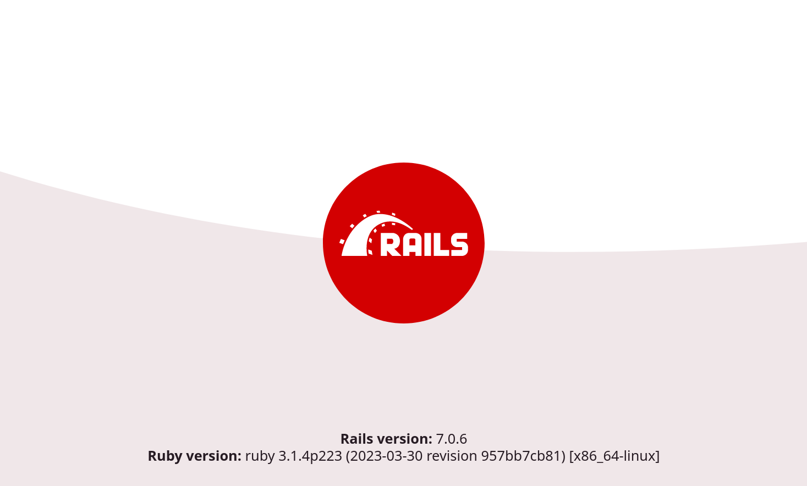

# Quickstart: Compose and Rails

This Quickstart guide shows you how to use Docker Compose to set up and run
a Rails/PostgreSQL app. Before starting, [install Compose](https://docs.docker.com/compose/install/).

## Define the project

### Dockerfile

Start by setting up the files needed to build the app. The app will run inside a
Docker container containing its dependencies. Defining dependencies is done using
a file called `Dockerfile`. To begin with, the  Dockerfile consists of:

```dockerfile
# syntax=docker/dockerfile:1
FROM ruby:3.2.2

# Install postgres client
RUN apt-get update && apt-get install -y postgresql-client

WORKDIR /app
COPY Gemfile /app/Gemfile
COPY Gemfile.lock /app/Gemfile.lock
RUN bundle install

COPY . /app

# Only necessary for production
# RUN rails assets:precompile

# Add a script to be executed every time the container starts.
COPY entrypoint.sh /usr/bin/
RUN chmod +x /usr/bin/entrypoint.sh
ENTRYPOINT ["entrypoint.sh"]

EXPOSE 3000

# Configure the main process to run when running the image
CMD ["rails", "server", "-b", "0.0.0.0"]
```

That'll put your application code inside an image that builds a container
with Ruby, Bundler and all your dependencies inside it. For more information on
how to write Dockerfiles, see the [Docker user guide](https://docs.docker.com/get-started/)
and the [Dockerfile reference](https://docs.docker.com/engine/reference/builder/).

# Set up Rails

Next, open an editor and create a bootstrap `Gemfile` which just loads Rails. This will be overwritten in a moment by `rails new`.

```ruby
source 'https://rubygems.org'
gem 'rails', '~>7'
```

Create an empty `Gemfile.lock` file to build our `Dockerfile`.

```console
$ touch Gemfile.lock
```

Next, provide an entrypoint script to fix a Rails-specific issue that
prevents the server from restarting when a certain `server.pid` file pre-exists.
This script will be executed every time the container gets started.
`entrypoint.sh` consists of:

```bash
#!/bin/bash
set -e

# Remove a potentially pre-existing server.pid for Rails.
rm -f /app/tmp/pids/server.pid

# Then exec the container's main process (what's set as CMD in the Dockerfile).
exec "$@"
```

### Compose file

Finally, `docker-compose.yml` is where the magic happens. This file describes
the services that comprise your app (a database and a web app), how to get each
one's Docker image (the database just runs on a pre-made PostgreSQL image, and
the web app is built from the current directory), and the configuration needed
to link them together and expose the web app's port.

```yaml
volumes:
  db-data:
  gems:

services:
  db:
    image: postgres:15
    volumes:
      - db-data:/var/lib/postgresql/data
    env_file: .env

  web:
    build: .
    volumes:
      - .:/app:z
      - gems:/usr/local/bundle
    ports:
      - "3000:3000"
    depends_on:
      - maildev # for email in dev, optional
      - db
    env_file: .env

    # lets you use the debugger
    # stdin_open: true
    # tty: true
  
  # Shows you emails sent by Rails at localhost:1080
  maildev:
    image: maildev/maildev:2.1.0
    ports:
      - "1080:1080"

  test:
    build: .
    volumes:
      - .:/app
      - gems:/usr/local/bundle
    depends_on:
      - db
      - chrome-server # For system tests, optional
    environment:
      RAILS_ENV: test
    env_file: .env

    # lets you use the debugger
    # stdin_open: true
    # tty: true

  # For system tests, optional
  chrome-server:
    image: selenium/standalone-chrome:114.0
    ports:
      - "7900:7900"
```

> **Tip**
>
> You can use either a `.yml` or `.yaml` extension for this file.

### Dot env file

You can see in the docker-compose.yml file:
```yaml
env_file: .env
```

We need to create that .env file, with the following content:

```bash
POSTGRES_PASSWORD=uniquesecretpassword
POSTGRES_USER=postgres
```
Feel free to make them unique.

Note for later: if you commit your code to git, make sure to add this .env file that has your
db password to .gitignore. You can use this file to store other secrets.

## Build the project

With those files in place, you can now generate the Rails skeleton app
using [docker compose run](https://docs.docker.com/engine/reference/commandline/compose_run/):

```console
$ docker compose run --no-deps web rails new . --force --database=postgresql
```

First, Compose builds the image for the `web` service using the `Dockerfile`.
The `--no-deps` tells Compose not to start linked services. Then it runs
`rails new` inside a new container, using that image. Once it's done, you
should have generated a fresh app.

List the files.

```console
$ ls -l

total 64
-rw-r--r--   1 vmb  staff   222 Jun  7 12:05 Dockerfile
-rw-r--r--   1 vmb  staff  1738 Jun  7 12:09 Gemfile
-rw-r--r--   1 vmb  staff  4297 Jun  7 12:09 Gemfile.lock
-rw-r--r--   1 vmb  staff   374 Jun  7 12:09 README.md
-rw-r--r--   1 vmb  staff   227 Jun  7 12:09 Rakefile
drwxr-xr-x  10 vmb  staff   340 Jun  7 12:09 app
drwxr-xr-x   8 vmb  staff   272 Jun  7 12:09 bin
drwxr-xr-x  14 vmb  staff   476 Jun  7 12:09 config
-rw-r--r--   1 vmb  staff   130 Jun  7 12:09 config.ru
drwxr-xr-x   3 vmb  staff   102 Jun  7 12:09 db
-rw-r--r--   1 vmb  staff   211 Jun  7 12:06 docker-compose.yml
-rw-r--r--   1 vmb  staff   184 Jun  7 12:08 entrypoint.sh
drwxr-xr-x   4 vmb  staff   136 Jun  7 12:09 lib
drwxr-xr-x   3 vmb  staff   102 Jun  7 12:09 log
-rw-r--r--   1 vmb  staff    63 Jun  7 12:09 package.json
drwxr-xr-x   9 vmb  staff   306 Jun  7 12:09 public
drwxr-xr-x   9 vmb  staff   306 Jun  7 12:09 test
drwxr-xr-x   4 vmb  staff   136 Jun  7 12:09 tmp
drwxr-xr-x   3 vmb  staff   102 Jun  7 12:09 vendor
```

If you are running Docker on Linux, the files `rails new` created are owned by
root. This happens because the container runs as the root user. If this is the
case, change the ownership of the new files.

```console
$ sudo chown -R $USER:$USER .
```

If you are running Docker on Mac or Windows, you should already have ownership
of all files, including those generated by `rails new`.

Now that you’ve got a new Gemfile, you need to build the image again. (This, and
changes to the `Gemfile` or the Dockerfile, should be the only times you’ll need
to rebuild.)

```console
$ docker compose build
```

## Connect the database

The app is now bootable, but you're not quite there yet. By default, Rails
expects a database to be running on `localhost` - so you need to point it at the
`db` container instead. You also need to change the database and username to
align with the defaults set by the `postgres` image.

Adapt the contents of `config/database.yml`.

The lines you need to add are marked with a comment.

```yaml
default: &default
  adapter: postgresql
  encoding: unicode
  # add what's below this
  host: db
  username: <%= ENV['POSTGRES_USER'] %>
  password: <%= ENV['POSTGRES_PASSWORD'] %>
  # and above this
  pool: <%= ENV.fetch("RAILS_MAX_THREADS") { 5 } %>

development:
  <<: *default
  database: app_development


test:
  <<: *default
  database: app_test
```

You can now boot the app with [docker compose up web](https://docs.docker.com/engine/reference/commandline/compose_up/).
If all is well, you should see some PostgreSQL output:

```console
$ docker compose up web

rails_db_1 is up-to-date
Creating rails_web_1 ... done
Attaching to rails_db_1, rails_web_1
db_1   | PostgreSQL init process complete; ready for start up.
db_1   |
db_1   | 2018-03-21 20:18:37.437 UTC [1] LOG:  listening on IPv4 address "0.0.0.0", port 5432
db_1   | 2018-03-21 20:18:37.437 UTC [1] LOG:  listening on IPv6 address "::", port 5432
db_1   | 2018-03-21 20:18:37.443 UTC [1] LOG:  listening on Unix socket "/var/run/postgresql/.s.PGSQL.5432"
db_1   | 2018-03-21 20:18:37.726 UTC [55] LOG:  database system was shut down at 2018-03-21 20:18:37 UTC
db_1   | 2018-03-21 20:18:37.772 UTC [1] LOG:  database system is ready to accept connections
```

Finally, you need to create the database. In another terminal, run:

```console
$ docker compose run web rails db:prepare
Starting rails_db_1 ... done
Created database 'app_development'
Created database 'app_test'
```

### View the Rails welcome page!

That's it. Your app should now be running on port 3000 on your Docker daemon.

On Docker Desktop for Mac and Docker Desktop for Windows, go to `http://localhost:3000` on a web
browser to see the Rails Welcome.



## Stop the application

To stop the application, run [docker compose down](https://docs.docker.com/engine/reference/commandline/compose_down/) in
your project directory. You can use the same terminal window in which you
started the database, or another one where you have access to a command prompt.
This is a clean way to stop the application.

```console
$ docker compose down

Stopping rails_web_1 ... done
Stopping rails_db_1 ... done
Removing rails_web_run_1 ... done
Removing rails_web_1 ... done
Removing rails_db_1 ... done
Removing network rails_default

```

## Restart the application

To restart the application run `docker compose up web` in the project directory.

## Rebuild the application

If you make changes to the Gemfile or the Compose file to try out some different
configurations, you need to rebuild. Some changes require only
`docker compose up --build`, but a full rebuild requires a re-run of
`docker compose run web bundle install` to sync changes in the `Gemfile.lock` to
the host, followed by `docker compose up --build`.

Here is an example of the first case, where a full rebuild is not necessary.
Suppose you simply want to change the exposed port on the local host from `3000`
in our first example to `3001`. Make the change to the Compose file to expose
port `3000` on the container through a new port, `3001`, on the host, and save
the changes:

```yaml
ports:
  - "3001:3000"
```

Now, rebuild and restart the app with `docker compose up --build`.

Inside the container, your app is running on the same port as before `3000`, but
the Rails Welcome is now available on `http://localhost:3001` on your local
host.

## How to use rails in Docker Compose
You probably guessed it from the step where we created the database: now you have to
prefix your rails commands with "docker compose run web"

If you want to migrate the database:

```console
docker compose run web rails db:migrate
```
If you want to see the routes:

```console
docker compose run web rails routes
```
NB: you can pipe it to other commands.

```console
docker compose run web rails routes | grep articles
```
And the rails console is waiting for you at

```console
docker compose run web rails console
```

Install some gems you added to your Gemfile:
```console
docker-compose run web bundle install
```

Drop in a terminal inside the rails container:
```console
docker-compose run web bash
```

## Configure mail

The app includes a maildev server so you can view emails sent by your app.
Comment out the maildev service if your app doesn't send email.

If it does, add this to config/development.rb

```yaml
config.action_mailer.delivery_method = :smtp
config.action_mailer.smtp_settings = {
  :address => 'maildev',
  :port => 1025,
  :openssl_verify_mode => 'none'
}
```
Now [set up a mailer](https://guides.rubyonrails.org/action_mailer_basics.html) and view all emails sent by
your app at http://localhost:1080

## Run some tests

Your tests are ready to run with:

```bash
docker compose run test rails test
```
Note how we're not running them from the "web" container, but from the "test" container.

Your system tests however, the ones that fire up an actual browser and simulate clicks and keyboard entries,
these tests won't work yet, as we need to point Rails to the Chrome browser included in the app in the
"chrome-server" service.

If you don't need system tests, ignore this and comment out the "chrome-server" service.

### Set up the browser for system tests

#### Point Capybara to the browser

Rails expects the browser to be local. We need to point it to the chrome-server.

Add the options to the driver definition in test/application_system_test_case.rb

```ruby
driven_by :selenium, using: :chrome, screen_size: [1400, 1400], options: {
    browser: :remote,
    url: "http://chrome-server:4444/wd/hub"
  }
```

#### Point the browser to your app

In test/test_helper.rb, add:

```ruby
Capybara.server_host = "0.0.0.0"
Capybara.app_host = "http://#{ENV.fetch("HOSTNAME")}:#{Capybara.server_port}"
```
It should be at the base of the file, outside of the TestCase class definition.

Now you can run your system tests:

```bash
docker compose run test rails test
```

#### Watch the system tests run

The chrome-server definition has an open port on the host:

```yaml
chrome-server:
  image: selenium/standalone-chrome
  ports:
    - "7900:7900"
```
This is so that you can watch them execute in the browser.

Before running your tests, start the chrome-server:

```bash
docker compose run chrome-server
```
Once it's up, visit localhost:7900 on your browser.

Click on "connect", enter the secret password (it's "secret"), and you'll see
a GUI workspace.

Now, from another terminal, launch your tests:

```bash
docker compose run test rails test:system
```
And watch a browser window (inside your browser window) go through all the steps.

Better with popcorn.

When you get tired of watching, you can remove the open ports on the "chrome-server" service
in the docker-compose file, and change the Selenium driver to :headless_chrome. It'll be a
little faster:

In test/application_system_test_case.rb:

```ruby
driven_by :selenium, using: :headless_chrome # ....
```

## More Compose documentation

* [Docker Compose overview](https://docs.docker.com/compose/)
* [Install Docker Compose](https://docs.docker.com/compose/install/)
* [Getting Started with Docker Compose](https://docs.docker.com/compose/gettingstarted/)
* [Docker Compose Command line reference](https://docs.docker.com/compose/reference/)
* [Compose file reference](https://docs.docker.com/compose/compose-file/)
