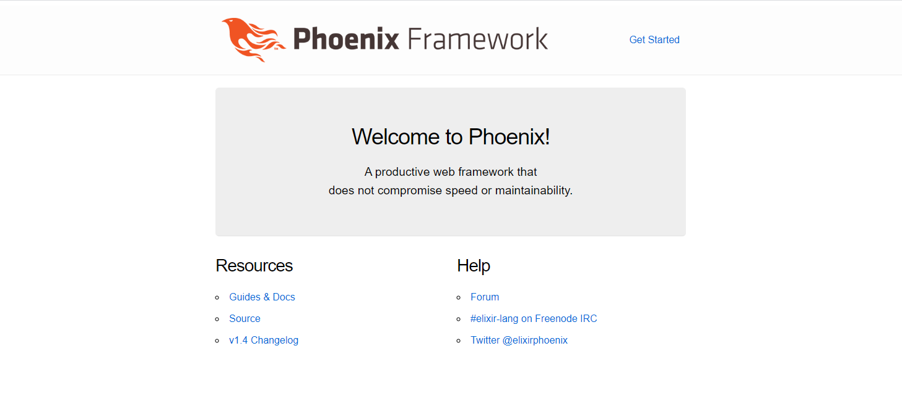

## Compose sample application
### Elixir application with Phoenix framework and a Postgres database

Project structure:
```
.
├── app
│   ├── Dockerfile
│   ...
├── docker-compose.yaml
├── phoenix_output.png
└── README.md
```

[_docker-compose.yaml_](docker-compose.yaml)
```
services:
  app:
    build: app
    environment:
      ...
  db:
    image: postgres
    ports: 
      - "5432:5432" 
    environment: 
      ...
```
The compose file defines an application with three services `app` and `db`.
When deploying the application, docker-compose maps the port 4000 of the app container to port 4000 of the host as specified in the file.
Make sure port 4000 on the host is not already being in use.

## Deploy with docker-compose

```
$ docker-compose up -d
Creating network "phoenix-postgres_default" with the default driver
Creating volume "phoenix-postgres_postgres" with default driver
...
Successfully built faa13730018d
Successfully tagged phoenix-postgres_app:latest
Image for service app was built because it did not already exist. To rebuild this image you must use `docker-compose build` or `docker-compose up --build`.
Creating phoenix-postgres_db_1      ... done
Creating phoenix-postgres_app_1     ... done
```

## Expected result

Listing containers must show two containers running and the port mapping as below:
```
$ docker ps
CONTAINER ID        IMAGE                          COMMAND                  CREATED             STATUS              PORTS                           NAMES
a12ab4dc42fb        phoenix-postgres_app           "sh entrypoint.sh"       22 seconds ago      Up 20 seconds       0.0.0.0:4000->4000/tcp          phoenix-postgres_app_1
39c7a3212d51        postgres                       "docker-entrypoint.s…"   23 seconds ago      Up 21 seconds       5432/tcp                        phoenix-postgres_db_1
```

After the application starts, navigate to `http://localhost:4000` in your web browser:



Stop and remove the containers
```
$ docker-compose down
Stopping phoenix-postgres_app_1     ... done
Stopping phoenix-postgres_db_1      ... done
Removing network phoenix-postgres_default
```