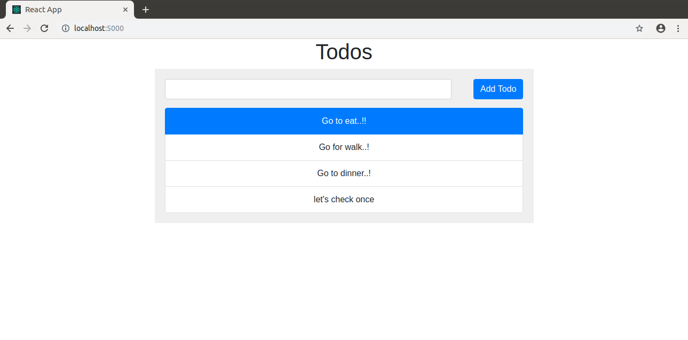

## Compose sample application
### React application with a NodeJS backend and a MongoDB database

Project structure:
```
.
├── backend
│   ├── Dockerfile
│   ...
├── docker-compose.yaml
├── frontend
│   ├── ...
│   └── Dockerfile
└── README.md
```

[_docker-compose.yaml_](docker-compose.yaml)
```
services:
  frontend:
    build:
      context: frontend
    ...
    ports:
      - 5000:5000
    ...
  server:
    container_name: server
    restart: always
    build:
      context: server
      args:
        NODE_PORT: 3000
    ports:
      - 3000:3000
    ...
    depends_on:
      - mongo
  mongo:
    container_name: mongo
    restart: always
    ...
```
The compose file defines an application with three services `frontend`, `backend` and `db`.
When deploying the application, docker-compose maps port 5000 of the frontend service container to port 5000 of the host as specified in the file.
Make sure port 5000 on the host is not already being in use.

## Deploy with docker-compose

```
$ docker-compose up -d
Creating network "react-express-mongodb_default" with the default driver
Building frontend
Step 1/9 : FROM node:13.13.0-stretch-slim
 ---> aa6432763c11
...
Successfully tagged react-express-mongodb_app:latest
WARNING: Image for service app was built because it did not already exist. To rebuild this image you must use `docker-compose build` or `docker-compose up --build`.
Creating frontend        ... done
Creating mongo           ... done
Creating app             ... done
```

## Expected result

Listing containers must show containers running and the port mapping as below:
```
$ docker ps
CONTAINER ID        IMAGE                               COMMAND                  CREATED             STATUS                  PORTS                      NAMES
06e606d69a0e        react-express-mongodb_server        "docker-entrypoint.s…"   23 minutes ago      Up 23 minutes           0.0.0.0:3000->3000/tcp     server
ff56585e1db4        react-express-mongodb_frontend      "docker-entrypoint.s…"   23 minutes ago      Up 23 minutes           0.0.0.0:5000->5000/tcp     frontend
a1f321f06490        mongo:4.2.0                         "docker-entrypoint.s…"   23 minutes ago      Up 23 minutes           0.0.0.0:27017->27017/tcp   mongo
```

After the application starts, navigate to `http://localhost:5000` in your web browser.



Stop and remove the containers
```
$ docker-compose down
Stopping server   ... done
Stopping frontend ... done
Stopping mongo    ... done
Removing server   ... done
Removing frontend ... done
Removing mongo    ... done
```

##### Explanation of `docker-compose`

__Version__

The first line defines the version of a file. It sounds confusing :confused:. What is meant by version of file ?? 

:pill: The Compose file is a YAML file defining services, networks, and volumes for a Docker application. So it is only a version of describing compose.yaml file. There are several versions of the Compose file format – 1, 2, 2.x, and 3.x.

__Services__

Our main goal to create a containers, it starts from here. As you can see there are three services(Docker images): 
- First is __frontend__ 
- Second is __server__ which is __backend - Express(NodeJS)__. I used a name server here, it's totally on you to name it __backend__.
- Third is __mongo__ which is db __MongoDB__.

##### Service app (backend - NodeJS)

We make image of app from our `DockeFile`, explanation below.

__Explanation of service server__

- Defining a **nodejs** service as __server__.
- We named our **node server** container service as **server**. Assigning a name to the containers makes it easier to read when there are lot of containers on a machine, it can aslo avoid randomly generated container names. (Although in this case, __container_name__ is also __server__, this is merely personal preference, the name of the service and container do not have to be the same.) 
- Docker container starts automatically if its fails.
- Building the __server__ image using the Dockerfile from the current directory and passing an argument to the
backend(server) `DockerFile`.
- Mapping the host port to the container port.

##### Service mongo

We add another service called **mongo** but this time instead of building it from `DockerFile` we write all the instruction here directly. We simply pull down the standard __mongo image__ from the [DockerHub](https://hub.docker.com/) registry as we have done it for Node image.

__Explanation of service mongo__

- Defining a **mongodb** service as __mongo__.
- Pulling the mongo 4.2.0 image image again from [DockerHub](https://hub.docker.com/).
- Mount our current db directory to container. 
- For persistent storage, we mount the host directory ( just like I did it in **Node** image inside `DockerFile` to reflect the changes) `/data` ( you need to create a directory in root of your project in order to save changes to locally as well) to the container directory `/data/db`, which was identified as a potential mount point in the `mongo Dockerfile` we saw earlier.
- Mounting volumes gives us persistent storage so when starting a new container, Docker Compose will use the volume of any previous containers and copy it to the new container, ensuring that no data is lost.
- Finally, we link/depends_on the app container to the mongo container so that the mongo service is reachable from the app service.
- In last mapping the host port to the container port.

:key: `If you wish to check your DB changes on your local machine as well. You should have installed MongoDB locally, otherwise you can't access your mongodb service of container from host machine.` 

:white_check_mark: You should check your __mongo__ version is same as used in image. You can see the version of __mongo__ image in `docker-compose `file, I used __image: mongo:4.2.0__. If your mongo db version on your machine is not same then furst you have to updated your  local __mongo__ version in order to works correctly.
