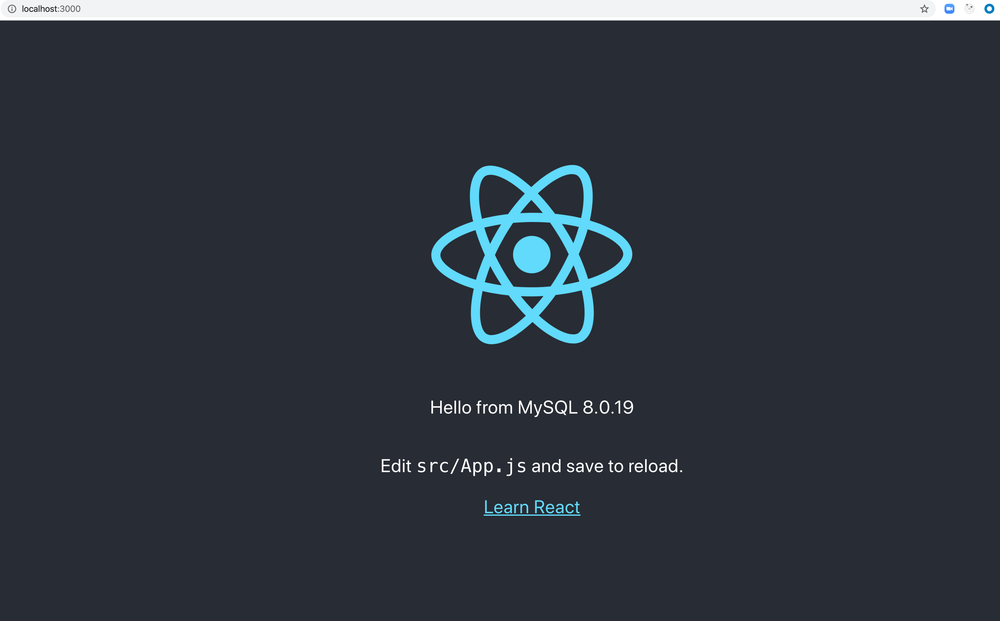

## Compose sample application

### Use with Docker Development Environments

You can open this sample in the Dev Environments feature of Docker Desktop version 4.12 or later.

[Open in Docker Dev Environments ](https://open.docker.com/dashboard/dev-envs?url=https://github.com/docker/awesome-compose/tree/master/react-express-mysql)

### React application with a NodeJS backend and a MySQL database

Project structure:
```
.
├── backend
│   ├── Dockerfile
│   ...
├── db
│   └── password.txt
├── compose.yaml
├── frontend
│   ├── ...
│   └── Dockerfile
└── README.md
```

[_compose.yaml_](compose.yaml)
```
services:
  backend:
    build: backend
    ports:
      - 80:80
      - 9229:9229
      - 9230:9230
    ...
  db:
    # We use a mariadb image which supports both amd64 & arm64 architecture
    image: mariadb:10.6.4-focal
    # If you really want to use MySQL, uncomment the following line
    #image: mysql:8.0.27
    ...
  frontend:
    build: frontend
    ports:
    - 3000:3000
    ...
```
The compose file defines an application with three services `frontend`, `backend` and `db`.
When deploying the application, docker compose maps port 3000 of the frontend service container to port 3000 of the host as specified in the file.
Make sure port 3000 on the host is not already being in use.

> ℹ️ **_INFO_**  
> For compatibility purpose between `AMD64` and `ARM64` architecture, we use a MariaDB as database instead of MySQL.  
> You still can use the MySQL image by uncommenting the following line in the Compose file   
> `#image: mysql:8.0.27`

## Deploy with docker compose

```
$ docker compose up -d
Creating network "react-express-mysql_default" with the default driver
Building backend
Step 1/16 : FROM node:10
 ---> aa6432763c11
...
Successfully tagged react-express-mysql_frontend:latest
WARNING: Image for service frontend was built because it did not already exist. To rebuild this image you must use `docker-compose build` or `docker-compose up --build`.
Creating react-express-mysql_db_1 ... done
Creating react-express-mysql_backend_1 ... done
Creating react-express-mysql_frontend_1 ... done
```

## Expected result

Listing containers must show containers running and the port mapping as below:
```
$ docker ps
CONTAINER ID        IMAGE                          COMMAND                  CREATED             STATUS                   PORTS                                                  NAMES
f3e1183e709e        react-express-mysql_frontend   "docker-entrypoint.s…"   8 minutes ago       Up 8 minutes             0.0.0.0:3000->3000/tcp                                 react-express-mysql_frontend_1
9422da53da76        react-express-mysql_backend    "docker-entrypoint.s…"   8 minutes ago       Up 8 minutes (healthy)   0.0.0.0:80->80/tcp, 0.0.0.0:9229-9230->9229-9230/tcp   react-express-mysql_backend_1
a434bce6d2be        mysql:8.0.19                   "docker-entrypoint.s…"   8 minutes ago       Up 8 minutes             3306/tcp, 33060/tcp                                    react-express-mysql_db_1
```

After the application starts, navigate to `http://localhost:3000` in your web browser.




The backend service container has the port 80 mapped to 80 on the host.
```
$ curl localhost:80
{"message":"Hello from MySQL 8.0.19"}
```

Stop and remove the containers
```
$ docker compose down
Stopping react-express-mysql_frontend_1 ... done
Stopping react-express-mysql_backend_1  ... done
Stopping react-express-mysql_db_1       ... done
Removing react-express-mysql_frontend_1 ... done
Removing react-express-mysql_backend_1  ... done
Removing react-express-mysql_db_1       ... done
Removing network react-express-mysql_default

```
