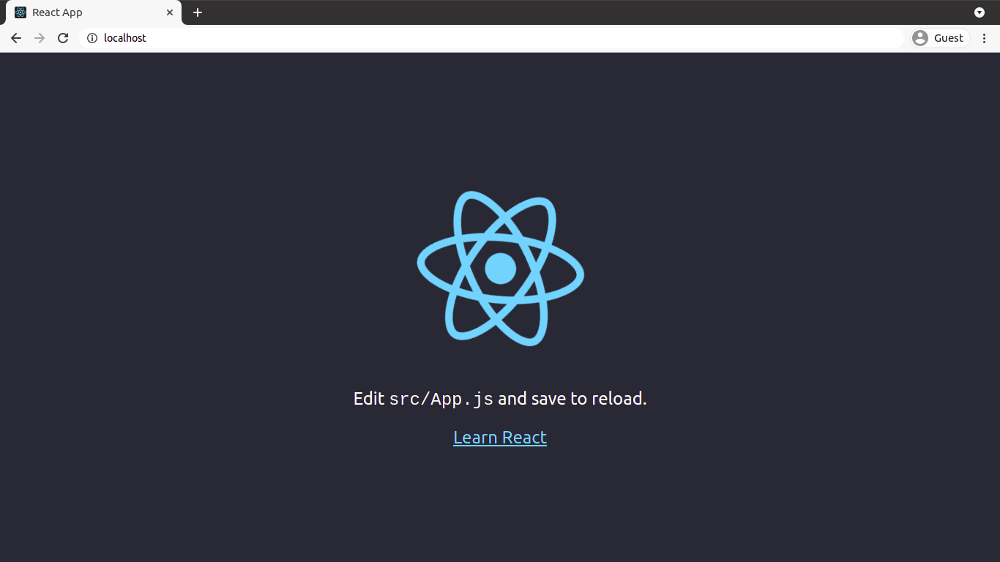

## Compose sample application

### Use with Docker Development Environments

You can open this sample in the Dev Environments feature of Docker Desktop version 4.12 or later.

[Open in Docker Dev Environments ](https://open.docker.com/dashboard/dev-envs?url=https://github.com/docker/awesome-compose/tree/master/react-nginx)

### An project deploy React Application with Nginx

Project structure:

```
├── compose.yaml
├── Dockerfile
├── .dockerignore
├── .nginx
│   └── nginx.conf
├── package.json
├── public
│   ├── ...
│   └── robots.txt
├── README.md
├── src
│   ├── ...
│   └── App.js
└── yarn.lock

```

[_compose.yaml_](compose.yaml)

```
services:
  frontend:
    build:
      context: .
    container_name: frontend
    ports:
      - "80:80"
```

The compose file defines an application with an services `frontend`.
When deploying the application, docker compose maps port 80 of the frontend service container to port 80 of the host as specified in the file.  

## Deploy with docker compose

```
$ docker compose up -d
Building frontend
Sending build context to Docker daemon   1.49MB

Step 1/17 : FROM node:lts AS development
 ---> 9153ee3e2ced
Step 2/17 : WORKDIR /app
 ---> Using cache
 ---> a7909d92148a
Step 3/17 : COPY package.json /app/package.json
 ---> 2e690dfe99b2
Step 4/17 : COPY package-lock.json /app/package-lock.json
 ---> dd0132803f43
 .....
Step 16/17 : COPY --from=build /app/build .
 ---> Using cache
 ---> 447488bdf601
Step 17/17 : ENTRYPOINT ["nginx", "-g", "daemon off;"]
 ---> Using cache
 ---> 6372a67cf86f
Successfully built 6372a67cf86f
Successfully tagged react-nginx_frontend:latest
```

## Expected result

Listing containers must show containers running and the port mapping as below:

```
$ docker ps

CONTAINER ID   IMAGE                  COMMAND                  CREATED              STATUS              PORTS                               NAMES
b6d00a4974ce   react-nginx_frontend   "nginx -g 'daemon of…"   About a minute ago   Up About a minute   0.0.0.0:80->80/tcp, :::80->80/tcp   frontend
```

After the application start, navigate to http://localhost in your browser:


Stop and remove the containers

```
$ docker compose down
Stopping frontend ... done
Removing frontend ... done
Removing network react-nginx_default
```
