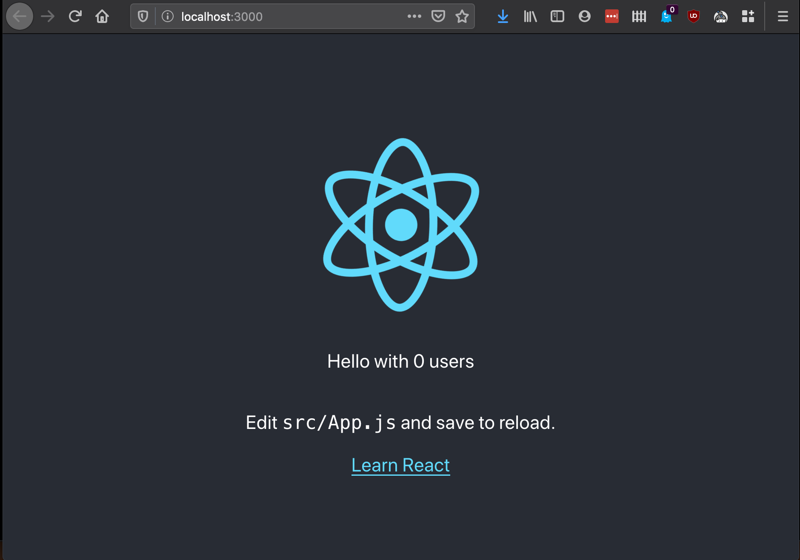

## Compose sample application
### React application with a Rust backend and a Postgresql database

Project structure:
```
.
├── backend
│   ├── Dockerfile
│   ...
├── compose.yaml
├── frontend
│   ├── ...
│   └── Dockerfile
└── README.md
```

[_compose.yaml_](compose.yaml)
```
services:
  backend:
    build: backend
    ...
  db:
    image: postgres:12-alpine
    ...
  frontend:
    build: frontend
    ports:
    - 3000:3000
    ...
```
The compose file defines an application with three services `frontend`, `backend` and `db`.
When deploying the application, docker compose maps port 3000 of the frontend service container to port 3000 of the host as specified in the file.
Make sure port 3000 on the host is not already being in use.

## Deploy with docker compose

```
$ docker compose up -d
Creating network "react-rust-postgres_default" with the default driver
Building backend
...
Successfully tagged react-rust-postgres_frontend:latest
WARNING: Image for service frontend was built because it did not already exist. To rebuild this image you must use `docker-compose build` or `docker-compose up --build`.
Creating react-rust-postgres_frontend_1 ... done
Creating react-rust-postgres_db_1       ... done
Creating react-rust-postgres_backend_1  ... done
```

## Expected result

Listing containers must show three containers running and the port mapping as below:
```
$ docker ps
CONTAINER ID        IMAGE                          COMMAND                  CREATED             STATUS              PORTS                    NAMES
30b7d9dc4898        react-rust-postgres_backend    "cargo run --offline"    37 seconds ago      Up 35 seconds       8000/tcp                 react-rust-postgres_backend_1
0bca0cb682b8        react-rust-postgres_frontend   "docker-entrypoint.s…"   42 seconds ago      Up 41 seconds       0.0.0.0:3000->3000/tcp   react-rust-postgres_frontend_1
1611961bf3d1        postgres:12-alpine             "docker-entrypoint.s…"   42 seconds ago      Up 36 seconds       0.0.0.0:5432->5432/tcp   react-rust-postgres_db_1
```

After the application starts, navigate to `http://localhost:3000` in your web browser to get a colorful message.



Stop and remove the containers
```
$ docker compose down
Stopping react-rust-postgres_backend_1  ... done
Stopping react-rust-postgres_frontend_1 ... done
Stopping react-rust-postgres_db_1       ... done
Removing react-rust-postgres_backend_1  ... done
Removing react-rust-postgres_frontend_1 ... done
Removing react-rust-postgres_db_1       ... done
Removing network react-rust-postgres_default
```
