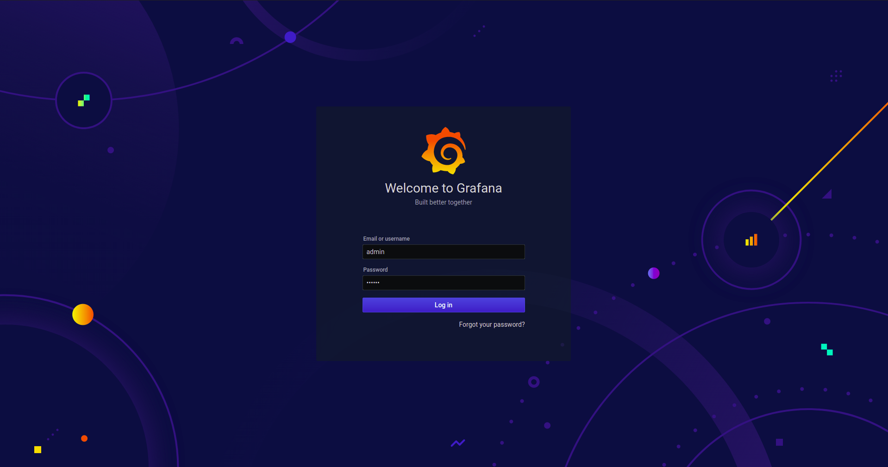

## Telegraf, InfluxDB and Grafana
This example defines one of the basic setups for Observability practice. These include, Telegraf working as client and collection agent, InfluxDB as Dtabase Time Series and Grafana for visualization of data.


Project structure:
```
.
├── docker-compose.yaml
└── README.md
```

[_docker-compose.yaml_](docker-compose.yaml)
```
services:
  influxdb:
    container_name: influxdb
    image: influxdb:latest
    volumes:
      - ./influxdb:/var/lib/influxdb
    ports:
      - "8086:8086"

  grafana:
    container_name: grafana
    image: grafana/grafana
    volumes:
      - "grafana:/var/lib/grafana"
    ports:
      - "3000:3000"

  telegraf:
    container_name: telegraf
    image: telegraf:latest

volumes:
  influxdb:
  grafana:
```
When deploying this setup docker-compose maps InfluxDB in the port 8086 and 3000 for Grafana. The Telegraf container enable to you to specify in a telegraf.conf file what systems you want to monitor. By default Telegraf going to connect to http://influxdb:8086 and start to report data about your server. 

## Deploy with docker-compose

```
$ docker compose up -d
Creating network "telegraf-influxdb-grafana_default" with the default driver
Creating influxdb ... done
Creating grafana  ... done
Creating telegraf ... done
```

## Expected result

Check containers are running and the port mapping:

```
$ docker ps
CONTAINER ID        IMAGE               COMMAND                  CREATED              STATUS              PORTS                          NAMES
0f33ea260aee        grafana/grafana     "/run.sh"                About a minute ago   Up 52 seconds       0.0.0.0:3000->3000/tcp         grafana
09aa6d8b4dc5        telegraf:latest     "/entrypoint.sh tele…"   About a minute ago   Up 51 seconds       8092/udp, 8125/udp, 8094/tcp   telegraf
0760db685a08        influxdb:latest     "/entrypoint.sh infl…"   About a minute ago   Up 51 seconds       0.0.0.0:8086->8086/tcp         influxdb
```

Navigate to `http://localhost:3000` in your web browser to access the installed Grafana. The default user and password is admin/admin



Stop and remove the containers

```
$ docker-compose down
```

To delete all data, remove all named volumes by passing the `-v` arguments:

```
$ docker-compose down -v
```