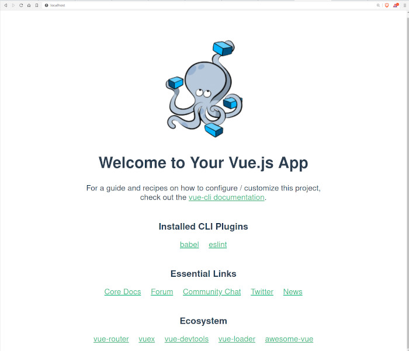

## Compose sample application
### VueJS 

Project structure:
```
.
├── docker-compose.yaml
├── README.md
└── vuejs
    ├── Dockerfile
    └── ...
```

[_docker-compose.yaml_](docker-compose.yaml)
```
version: "3.7"
services:
  web:
    build: vuejs
    ports:
    - 80:8080
    volumes:
    - ./vuejs:/project
    - /project/node_modules
```
The compose file defines an application with one service `sparkjava`.
When deploying the application, docker-compose maps port 8080 of the web service container to port 8080 of the host as specified in the file.
Make sure port 8080 on the host is not already being in use.

## Deploy with docker-compose

```
$ docker-compose up -d
Creating network "vuejs_default" with the default driver
Building web
Step 1/8 : FROM node:13.10.1-alpine
...
Successfully tagged vuejs_web:latest
WARNING: Image for service web was built because it did not already exist. To rebuild this image you must use `docker-compose build` or `docker-compose up --build`.
Creating vuejs_web_1 ... done
```

## Expected result

Listing containers must show one container running and the port mapping as below:
```
$ docker ps
CONTAINER ID        IMAGE               COMMAND                  CREATED             STATUS              PORTS                  NAMES
701c02bb97b1        vuejs_web           "docker-entrypoint.s…"   49 seconds ago      Up 46 seconds       0.0.0.0:80->8080/tcp   vuejs_web_1
```

After the application starts, navigate to `http://localhost:80` in your web browser.



Stop and remove the containers
```
$ docker-compose down
Stopping vuejs_web_1 ... done
Removing vuejs_web_1 ... done
Removing network vuejs_default
```
