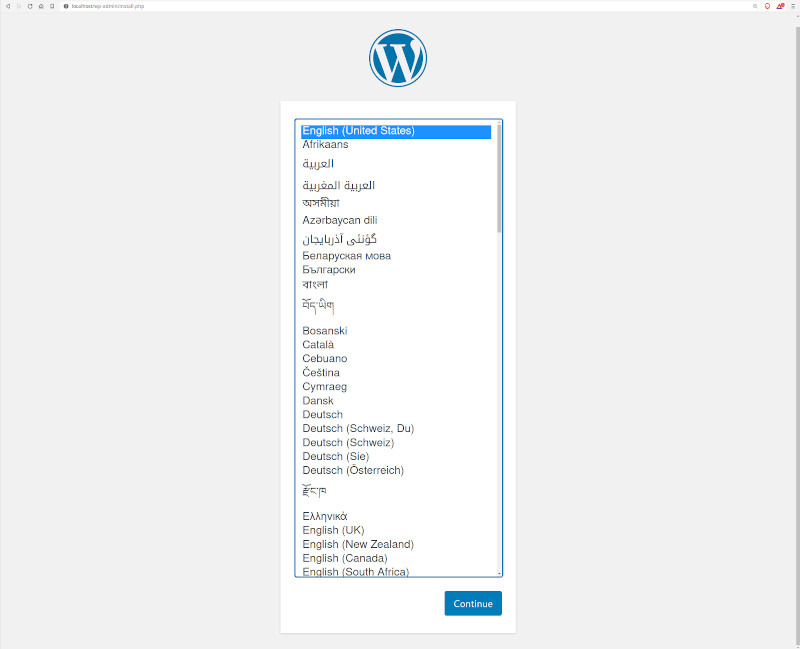

## WordPress with MySQL
This example defines one of the basic setups for WordPress. More details on how this works can be found on the official [WordPress image page](https://hub.docker.com/_/wordpress).


Project structure:
```
.
├── compose.yaml
└── README.md
```

[_compose.yaml_](compose.yaml)
```
services:
  db:
    # We use a mariadb image which supports both amd64 & arm64 architecture
    image: mariadb:10.6.4-focal
    # If you really want to use MySQL, uncomment the following line
    #image: mysql:8.0.27
    ...
  wordpress:
    image: wordpress:latest
    ports:
      - 80:80
    restart: always
    ...
```

When deploying this setup, docker compose maps the WordPress container port 80 to
port 80 of the host as specified in the compose file.

> ℹ️ **_INFO_**  
> For compatibility purpose between `AMD64` and `ARM64` architecture, we use a MariaDB as database instead of MySQL.  
> You still can use the MySQL image by uncommenting the following line in the Compose file   
> `#image: mysql:8.0.27`

## Deploy with docker compose

```
$ docker compose up -d
Creating network "wordpress-mysql_default" with the default driver
Creating volume "wordpress-mysql_db_data" with default driver
...
Creating wordpress-mysql_db_1        ... done
Creating wordpress-mysql_wordpress_1 ... done
```


## Expected result

Check containers are running and the port mapping:
```
$ docker ps
CONTAINER ID        IMAGE               COMMAND                  CREATED             STATUS              PORTS                 NAMES
5fbb4181a069        wordpress:latest    "docker-entrypoint.s…"   35 seconds ago      Up 34 seconds       0.0.0.0:80->80/tcp    wordpress-mysql_wordpress_1
e0884a8d444d        mysql:8.0.19        "docker-entrypoint.s…"   35 seconds ago      Up 34 seconds       3306/tcp, 33060/tcp   wordpress-mysql_db_1
```

Navigate to `http://localhost:80` in your web browser to access WordPress.



Stop and remove the containers

```
$ docker compose down
```

To remove all WordPress data, delete the named volumes by passing the `-v` parameter:
```
$ docker compose down -v
```
